<p align="center">
  
</p>

<p align="center">
  <a href="https://github.com/WhoSowSee/gitow/graphs/contributors"></a>
  <a href="https://github.com/WhoSowSee/gitow/forks"></a>
  <a href="https://github.com/WhoSowSee/gitow/stargazers"></a>
</p>

<p align="center">
  <a href="https://crates.io/crates/gitow"></a>
  <a href="https://crates.io/crates/gitow"></a>
</p>

<h2 align="center">Open Git repository pages from the command line</h2>

<p align="center">
  
</p>

> [!TIP]
> **Русская версия:** [README-RU.md](README-RU.md)

> [!NOTE]
> **gitow - git open web.** A Rust CLI focused on opening repository web pages from the current working tree. It offers:
>
> - **Repository navigation** - Open repository roots, branches, commits, issues, pull requests, commit history, releases, tracked files, and custom URL suffixes.
> - **Remote resolution** - Resolve Git remote names, literal remote URLs, `insteadOf` rewrites, and SSH config aliases.
> - **Branch-aware links** - Pick the upstream branch, current branch, exact tag, or current commit SHA depending on repository state.
> - **Multi-remote workflow** - Open every configured remote with `--all-remotes`, keeping `origin` first.
> - **Script-friendly output** - Print generated URLs with `--print` or `BROWSER=echo` without launching a browser.
> - **Short command surface** - Use one compact `gitow` binary for every navigation target.

> [!IMPORTANT]
>
> ## Required dependencies:
>
> - Git
> - Rust 1.95 or newer
> - Platform browser launcher or a `BROWSER` command

## Installation

### Install from crates.io

```bash
cargo install gitow
```

This installs the latest published release from crates.io into your Cargo bin directory.

### Install with Nix (Flake)

```bash
nix run github:WhoSowSee/gitow
nix profile install github:WhoSowSee/gitow
```

Use `nix run` to try it without installing, or `nix profile install` for a persistent install.

### Install with Snap (Linux)

Download the `.snap` package for your architecture from [GitHub Releases](https://github.com/WhoSowSee/gitow/releases): `amd64` for x86-64 or `arm64` for ARM64.
With `snapd` installed, replace `./gitow.snap` below with the path to the downloaded file:

```bash
sudo snap install --dangerous --classic ./gitow.snap
snap run gitow
```

`--dangerous` allows installing the local package without a Snap Store signature; `--classic` is required for access to repositories and the system browser.
Run `snap run gitow` from your Git working tree.

### Install from source

```bash
git clone https://github.com/WhoSowSee/gitow.git
cd gitow
cargo install --path .
```

The command above builds `gitow` and places the binary into the Cargo bin directory, usually `~/.cargo/bin`.

### Run locally without installing

```bash
cargo build --release
./target/release/gitow --print
```

Run the binary through Cargo with:

```bash
cargo run --bin gitow -- --print
```

## Usage

```text
gitow [OPTIONS] [REMOTE_OR_URL] [BRANCH]
```

Examples:

```bash
gitow
gitow upstream
gitow upstream feature/my-branch
gitow git@github.com:owner/repo.git
gitow https://gitlab.example.com/group/project.git main
gitow --print
```

### Navigation targets

- `-c, --commit` - opens the current commit in the forge UI.
- `-i, --issue` - opens the issue inferred from the current branch name.
- `-m, --pull-requests` - opens the pull requests or merge requests page.
- `-C, --commits` - opens the commits page for the selected branch or ref.
- `-r, --releases` - opens the releases page where the forge supports it.
- `-a, --all-remotes` - opens every configured remote.
- `-f, --file <PATH>` - opens a repository-relative tracked file.
- `-s, --suffix <SUFFIX>` - appends an arbitrary suffix to the generated URL.
- `-p, --print` - prints the URL instead of launching a browser.
- `-h, --help` - shows the help text.

### Common workflows

```bash
gitow --commit
gitow --issue
gitow --pull-requests
gitow --commits
gitow --releases
gitow --all-remotes
gitow --file src/main.rs
gitow --suffix actions
gitow --print
```

## Remote and branch selection

By default, `gitow` opens:

1. `open.default.remote`, if configured.
2. `origin`, if configured.
3. The current branch's tracked remote, if configured.

For the ref, it uses the selected branch's upstream branch when available, otherwise the current branch. In detached `HEAD` state, it falls back to an exact tag and then to the current commit SHA.

## Supported remote repositories

`gitow` detects URL layouts for:

- GitHub
- GitHub Gist
- GitLab.com and self-hosted GitLab instances
- Gitea, Forgejo, Gogs, and Codeberg
- Bitbucket Cloud
- Bitbucket Server / Atlassian Stash
- Azure DevOps / Visual Studio Team Services / Team Foundation Server
- AWS CodeCommit
- generic Git hosting URLs

Some pages are forge-specific. Releases are supported for GitHub, GitLab, and Gitea-compatible forges. AWS CodeCommit does not support the issue shortcut.

## Configuration

`gitow` uses normal Git configuration. Add `--global` to apply an option to all repositories.

### Default remote

Set the remote that should be opened when no remote argument is provided:

```bash
git config open.default.remote upstream
```

### Custom web domain and protocol

If the Git remote host differs from the web UI host, configure URL-matched overrides:

```bash
git config "open.https://git.example.com.domain" "repo.intranet/subpath"
git config "open.https://git.example.com.protocol" "http"
```

For example, a remote like:

```text
ssh://git@git.example.com:7000/team/repo.git
```

can open as:

```text
http://repo.intranet/subpath/team/repo
```

### Gitea, Forgejo, and Gogs

Gitea-compatible forges use a different branch URL layout. Codeberg and domains containing `gitea`, `forgejo`, or `gogs` are detected automatically. For custom domains, configure the forge type explicitly:

```bash
git config "open.https://git.internal.example.forge" "gitea"
```

Accepted values `gitea`, `forgejo`, and `gogs` are normalized to `gitea`.

### SSH config aliases

SCP-style remotes can be resolved through SSH config aliases:

```text
Host work
  HostName git.internal.example
```

```bash
git remote set-url origin work:team/repo.git
gitow --print
# prints https://git.internal.example/team/repo
```

The tool reads the path from the `GITOW_SSH_CONFIG` environment variable first, then falls back to `$HOME/.ssh/config` when it exists.

## Browser selection and debugging

By default, `gitow` uses the platform browser launcher:

- Windows: `cmd /C start`
- macOS: `open`
- Linux: `xdg-open`
- WSL: Windows PowerShell `Start`

Set `BROWSER` to use a specific browser command:

```bash
BROWSER=firefox gitow
```

Use `--print` or `BROWSER=echo` to inspect generated URLs without opening a browser:

```bash
gitow --print
BROWSER=echo gitow
```

## Development

```bash
cargo fmt --check
cargo clippy --all-targets -- -D warnings
cargo test
```

## Star History

<p align="center">
  <a href="https://starchart.cc/WhoSowSee/gitow">
    <picture>
      <source
        media="(prefers-color-scheme: dark)"
        srcset="https://starchart.cc/WhoSowSee/gitow.svg?variant=custom&background=%230d1117&axis=%238b949e&line=%232f81f7"
      />
      <source
        media="(prefers-color-scheme: light)"
        srcset="https://starchart.cc/WhoSowSee/gitow.svg?variant=custom&background=%23ffffff&axis=%2357606a&line=%230969da"
      />
      
    </picture>
  </a>
</p>

<p align="center">
  
</p>

<p align="center">
  <i><code>&copy 2026-present <a href="https://github.com/WhoSowSee">WhoSowSee</a></code></i>
</p>

<p align="center">
  <a href="https://github.com/WhoSowSee/gitow/blob/main/LICENSE"></a>
</p>
